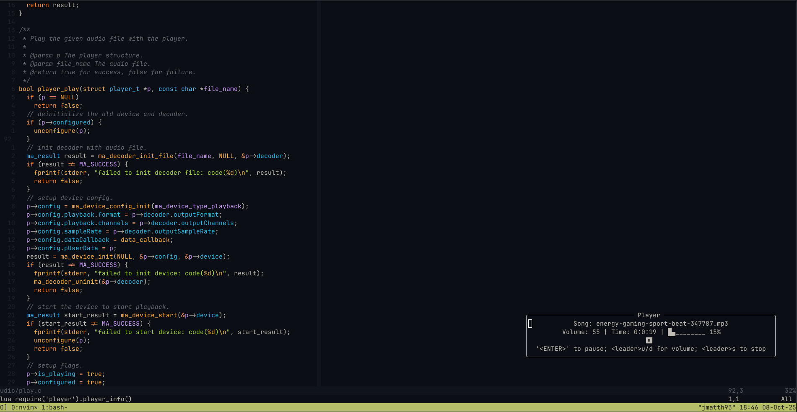
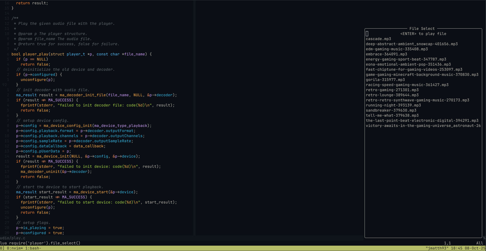

# Player.nvim

Simple plugin to play local audio files through neovim. (currently only tested on linux-like environments)

## Dependencies

- [Zig](https://github.com/ziglang/zig) - for the build system. (v0.15.1)
- [`nvim-lua/plenary.nvim`](https://github.com/nvim-lua/plenary.nvim) - for window management.

### Installing Zig Dependency

Their [install page](https://github.com/ziglang/zig/wiki/Install-Zig-from-a-Package-Manager) with various package managers.

Quick ref for linux and macos:

Linux (apt-based):

```bash
# ensure snap is installed
sudo apt install -y snapd
sudo snap install zig --classic --beta
```

MacOS:

```bash
brew install zig
```


## Configure

Lazy.nvim
```lua
  'jmatth11/player.nvim',
  -- requires zig to build the plugin
  build = "zig build",
  -- Required to properly setup the player.
  config = true,
  dependencies = {
    "nvim-lua/plenary.nvim", -- required for window management
  },
```

Setup options:

```lua
{
  -- Set the parent directory for your audio files.
  -- default is home directory
  parent_dir = vim.env.HOME,
  -- The scale at which the volume increments and decrements.
  -- default is 5
  volume_scale = 5,
  -- Flag to redraw the player info window every second when it's open.
  -- Default is true.
  live_update = true,
  -- Search for songs in the parent directory recursively.
  -- Default is false.
  recursive = false,
}
```

## Usage

The plugin is configured to kill the player automatically when you exit neovim.
So there is no need to call it yourself.

### Recommended Mappings

```lua
-- <leader>pp to toggle the player info window.
vim.keymap.set(
    "n",
    "<leader>pp",
    ":lua require('player').player_info()<CR>",
    {noremap = true},
)
-- <leader>pf to toggle the file select window.
vim.keymap.set(
    "n",
    "<leader>pf",
    ":lua require('player').file_select()<CR>",
    {noremap = true},
)
```

Using the player info window or the file select window is the recommended way
to interact with this plugin. These windows display their respective
key-bindings to perform tasks.

The player info window allows you to control the pause/resume/stop action of
the song as well as increasing or lowering the volume.

The file select window displays all the songs from your parent directory and allows
you press `<ENTER>` to start playing a song from the list.

### Manual Controls

Play a song.

This function will prepend the parent directory set in the setup options.
So you only need to pass the filename relative to that point.

```lua
require('player').play(<song name>)
```

Controlling pause/resume.

```lua
require('player').pause()
require('player').resume()
```

Controlling volume.

```lua
require('player').volume_up()
require('player').volume_down()
```

Open control windows.

```lua
-- The player info on the currently playing song.
require('player').player_info()
-- The file selection window of the music within your parent directory.
require('player').file_select()
```

## Screenshots





## Demo

https://github.com/user-attachments/assets/5a35b49d-d420-4d13-be69-13637d7cc59b

## Known issues

- Audio playback on WSL is not great and sometimes becomes very choppy.
  [ref](https://github.com/microsoft/wslg/issues/908)
